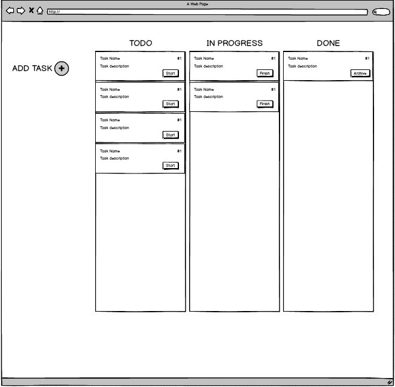
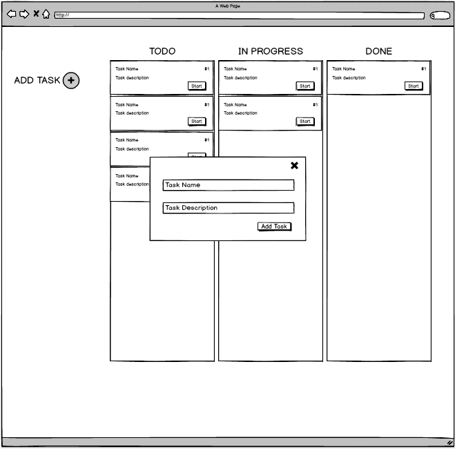

# VS Tracker

This is a simple task manager built with React for [Versus Systems](http://www.versussystems.com/)'s front-end challenge


## Install

Install project depenedencies using the following command:

```bash
$ yarn
```

*Note: To run the preceding command, [yarn](https://yarnpkg.com) must be installed.*

## Usage

Use the following command to start the app:

```bash
$ yarn start
```

If the application isn't opened in your default browser after running the previous command, you can simply open `./public/index.html` in a browser manually.

To run tests use:

```bash
$ yarn test
```

## Requirements

### Mocks

 

As a user working on a project I can add new tasks and transition those tasks to multiple states, so that I can track the work I need to do. 
 
### Required Features
- Ability to add new tasks to a project
- Ability to move Tasks from Todo -> In Progress 
- Ability to move Tasks from In Progress -> Complete  
- Ability to move Tasks from Complete -> Archive
- When a Task is archived it is no longer in view
 
### Acceptance Criteria
- Use the following URL to seed the initial application data - https://private-caaa7-versustracker.apiary-mock.com/tasks
- Please review the mockups (attached) for how we would like it structured
- When adding a new task the dialog is a modal that appears on top of the existing UI
- New tasks default to the TODO state
- Please use [Material-UI](http://www.material-ui.com) for standard UI components, feel free to pull in any other dependencies else you may need
 
### Notes
- Do not forget a README with including installation, run, and instructions to run the tests
- We do not expect you to send any data back to a server with the status of the projects and tasks

